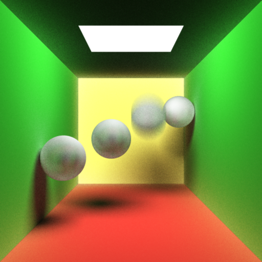

# Monte Carlo Ray Tracing in CUDA



This project implements Monte Carlo ray tracing in CUDA. It is a simplified version of another C++ ray tracer, which is accelerated by MPI. You can check it out [here](https://github.com/TitiSkywalker/Graphics).

## 0. Table of contents
- [Installation](#1-Installation)
- [Usage](#2-Usage)
    - [File Structure](#21-File-Structure)
    - [Configuration](#22-Configuration)
    - [Execution](#23-Execution)
- [Implementation](#3-implementation)
    - [Parallelization](#31-Parallelization)
    - [Eliminate Recursions](#32-Eliminate-Recursions)
    - [Warp Divergence](#33-Warp-Divergence)
    - [Shared Memory](#34-Shared-Memory)
- [Error Handling](#4-Error-Handling)
- [Examples](#5-Examples)
- [Future Works](#6-Future-Works)
- [License](#7-License)
- [Acknowledgements](#8-Acknowledgements)

## 1. Installation
**Windows 10 or 11**. I'm not using any system kernel function, so maybe it will also work on Linux and macOS.

**Visual Studio 2022**. This project is created and build by Visual Studio, because I don't know how to install CUDA on Windows without installing Visual Studio (I have been searching this on the Internet for a long time).

**CUDA 12.3**. I have a **Nvidia GeForce RTX 3050** GPU. It's valid if you have other versions of CUDA, because I'm only using basic features of CUDA. All I need is ability to invoke kernel function and access shared memory.

## 2. Usage
### 2.1 File Structure
To prepare for the rendering, please make sure you have these directories within the project directory: 

```
Graphics
├─input
│  └─in.scene
│  └─...
├─mesh
│  └─model.obj
│  └─...
├─output
   └─out.bmp
   └─...

```

The **.scene** file contains information about the scene, such as position and color of lights and objects. The program will read in the **.scene** file, parse meshes and textures, then store the result in "output/" as a **.bmp** file.

### 2.2 Configuration
You might want to go to [code/Configuration.cuh](code/Configuration.cuh) and set up desired parameters, this is the content: 

```C++
//image size
static const int WIDTH = 512;
static const int HEIGHT = 512;

//the shape of each thread block(warning: too many threads will cause stack overflow)
static const int BLOCKX = 32;
static const int BLOCKY = 16;

//ray tracing parameter
static const int SAMPLERATE = 20;
static const int MAXDEPTH = 10;

//perform anti-aliasing?
static const bool SUPERSAMPLING = true;	
static const bool GAUSSIANBLUR = true;	

//input and output files
static const int CHOICE = 0;
static const char* getInputFile(int choice)
{
    switch (choice)
    {
    case 0:
        return "scene0_sphere.scene";
    default:
        return "scene0_sphere.scene";
    }
}

static const char* getOutputFile(int choice)
{
    switch (choice)
    {
    case 0:
        return "scene0_sphere.bmp";
    default:
        return "scene0_sphere.bmp";
    }
}
```

### 2.3 Execution
There is nothing to do here, you can just press the "Build" and "Run" buttons in Visual Studio.

## 3. Implementation
In this section, I will discuss some special concerns when implementing ray tracing in CUDA. Ray tracing is relatively easy, but the computational issues will remain critical.

> I do not understand how CUDA linker works in Visual Studio, so I am forced to write everything in CUDA header files... 

### 3.1 Parallelization
Doing ray tracing with GPU is intuitively straightforward, I just let each thread render one pixel. 

### 3.2 Eliminate Recursions
Ray tracing is all about recursion, but recursion is one of the largest weaknesses in CUDA. The stack space in GPU is limited, so we cannot afford to do many recursions, otherwise it will trigger stack overflow. But in Russian roulette algorithm, we even need to recurse infinitely many times. Thus, it is crucial to reduce the conflict between recursion and GPU.

To tackle this problem, I have converted all recursions into loops. This is done by maintaining extra information about the context of current ray. This loop is implemented in [GPURenderer.cuh](./code/GPURenderer.cuh). You can find it in the kernel function **render** . Here is the idea expressed in pseudo-code:

```
Initialize light rays:
    prev_r = input ray
    this_r = input ray
    next_r = input ray

Initialize hit points:
    prev_hit = inf
    this_hit = inf

Solve first intersection:
    intersect with next_r
    next_r      = secondary ray (reflected, refracted, etc)
    this_hit    = hit point
    prev_hit    = this_hit
    local_color = local color at hit point
    this_r      = next_r

Loop (recursion depth-1) iterations:
    intersect with next_r
    next_r      = secondary ray
    this_hit    = hit point
    trace_color = local color at hit point
    
    local_color = blend local color with trace color

    prev_r      = this_r
    this_r      = next_r
    prev_hit    = this_hit
```

You might wonder what's the point of saving those meaningless hit points and rays. To blend the local color and the color from secondary rays, we need:
- normal at local point. This is saved in **prev_hit**.
- input ray. This is saved in **prev_r**.
- secondary ray. This is saved in **this_r**.

As for **this_hit** and **next_r**, they are used to store the next point to do ray tracing. In this way, we successfully enable GPU to do ray tracing for any desired depth. The memory usage is O(1). 

### 3.3 Warp Divergence
Warp divergence usually occur when each thread in a thread block perform different tasks. Those tasks are executed serially within the GPU, causing severe decrease in performance. Theoretically it is impossible to eliminate warp divergence in ray tracing, because each thread will hit different objects. 

However, real life is not that bad. Another important property of ray tracing is that it has strong locality. This guarantees that most threads in a thread block are likely to "do the same thing".

### 3.4 Shared Memory
All objects, lights and materials are allocated in global memory, which is large but slow. To accelerate memory IO operation, I apply a batch operation to all objects and lights. This is implemented in [GPURenderer.cuh](code/GPURenderer.cuh). You can find it in the kernel function **moveSharedGroup**. The pseudo-code is as follows:

```
base_index  = starting index of current batch
block shape = (dim_x, dim_y)
batch size  = dim_x
for each thread with dim_y = 0:
    move objects[base_index + dim_x] into shared memory
    move lights[base_index + dim_x] into shared memory
```

In this way, the total number of memory transactions is largely reduced. However, it is not easy to batch materials, because we cannot predict the material of the hit object. To further optimize performance, we might exploit the locality brought by ray tracing.

> Memory coalescing is not easy to achieve in ray tracing.

## 4. Error Handling
For all used CUDA built-in operations, I have created a wrapper function to provide extra supervision and information. For example, I have modifies **cudaMalloc** so that it is safer and easier to debug. You can find these wrapped functions in [Tool.cuh](code/Tool.cuh).

```C++
static void cudaMallocChecked(void** address, int size, string location = "???")
{
    auto error = cudaMalloc(address, size);
    if (error != cudaSuccess)
    {
        cout << "Error: GPU memory allocation failed at " << location << endl;
        cout << "Message: " << cudaGetErrorString(error) << endl;
    }
}
```

One interesting fact is that memory leak will never happen in GPU, since the GPU driver will erase everything after the program terminates. But I still release all memories during execution, because it is a good habit.

I also handle errors while parsing the scene file, because the declarations may be invalid. I throw **runtime_error** whenever something is wrong and abort as soon as possible. For convenience, each error has an error message.

## 5. Examples
This project is relatively simple. It can only render planes, spheres and triangles. You can modify the parameters, or define new scenes by editing the [.scene file](input/scene0_sphere.scene).

## 6. Future Works
Apart from adding transformations, textures and more material types, the most important thing to do is rendering triangle meshes. Maintaining a kd-tree or a BVH in GPU is hard, but can be done. To avoid warp divergence, we again need to turn recursions into loops. To traverse a tree with GPU, we need to keep track of the pointers. We might need extra nodes to represent "NULL".

Also, we might consider exploiting other features of GPU, such as constant memory or texture memory. By putting triangle meshes in constant memory, we might benefit from broadcasting mechanisms in GPU. 

## 7. License
Please check out [License.txt](License.txt).

## 8. Acknowledgements
I would like to thank MIT professor Justin Solomon for his great lectures on computer graphics.

*CUDA Programming: A Developer's Guide to Parallel Computing with GPUs* is a great book for studying CUDA programming, though it is a little bit outdated: https://dl.acm.org/doi/book/10.5555/2430671